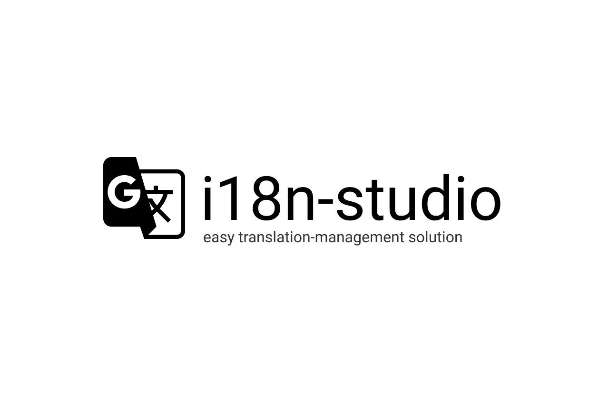

# i18n-studio 
[](https://github.com/dominique-boerner/i18n-studio/actions/workflows/nodejs.yaml)



i18n-Studio is a self-hosted solution for managing translation files. It helps with:

* **file analyzing**: Analysis of the translation files for errors or different keys.
* **adding translations**: Add translations across multiple files via a UI to prevent errors.
* **provide translations**: Provide translations for your application via a modern REST API.

<i style="color: #1586F7">This project is currently a work in progress. The above features 
do not yet correspond to the project, and are only planned.</i>

## Understand this workspace

The workspace is a monorepo that uses [NX](https://nx.dev/). Run `nx graph` to see a diagram of the
dependencies of the projects.

## 🖥️ Installation

### Prerequisites

To install the project, the following things are needed:

* [**Node**](https://nodejs.org/en/download): 16.x
* [**Git**](https://git-scm.com/)

### Checkout

Clone this repository via:

```bash
$ git clone https://github.com/dominique-boerner/i18n-studio.git 
```

### Install

Navigate into the repository and install the dependencies via:

```bash
$ cd i18n-studio
$ npm install
```

## 🧑🏽‍💻 Development server

The project is divided into two applications:

### frontend

The front-end is a VueJS application using TailwindCSS. It connects to the studio-adapter 
via [Socket.io](https://socket.io/) and provide a UI to perform various CRUD actions.

To serve the frontend run this command:

```bash 
$ npm run serve:frontend
```

### studio-adapter

This adapter is used for I/O with the file system. It reads the files from a specific
folder and stream them via [Socket.io](https://socket.io/) to the frontend. Every operation
with the file system should be handled by the studio-adapter.

To serve the adapter, run this command:

```bash 
$ npm run serve:adapter
```

## 🐋 Run via Docker

It is possible to start i18n-studio in a Docker environment. To start the application as Docker, 
the following command must be executed:

```bash
$ npm run docker:compose
```

This command will run docker build and docker compose up on your machine. When the container has 
been created, the front end is located at http://localhost:3000.

## ✅ Dependency check

The project uses a dependency checker [(Snyk)](https://snyk.io/advisor/npm-package/check-packages) to 
monitor the health of NPM packages. Since i18n-studio connects directly to the file system via the adapter, 
we want to offer users the highest possible security and prevent vulnerabilities.

If NPM packages should be excluded from the analysis, they must be included in the 
```packages-blacklist.json```.

The package health check can be launched via:

```bash 
$ check-packages --blacklist
```

## 📋 Features

Below you will find a list of planned features. The list is not complete and 
can be extended at any time.

| Feature                                      | Completion |
|----------------------------------------------|------------|
| Set up repository                            | ✔️         |
| Set up basic CI Pipeline                     | ✔️         |
| serve via docker                             | ️          |
| Backend: get all files                       | ✔️         |
| Backend: get file content                    | ✔️         |
| Backend: create new translation files        |            |
| Backend: create new translations             |            |
| Backend: update translation files            |            |
| Backend: update translations                 |            |
| Backend: remove translation files            |            |
| Backend: remove translations                 |            |
| Backend: configuration                       | ✔️         |
| Backend: analyze files: soft                 | ✔️         |
| Backend: analyze files: hard                 |            |
| Backend: serve files via REST                |            |
| Frontend: navigate between translation files | ✔️         |
| Frontend: navigate between translations      |            |
| Frontend: create new translation files       |            |
| Frontend: create new translations            |            |
| Frontend: update translation files           |            |
| Frontend: update translations                |            |
| Frontend: remove translation files           |            |
| Frontend: remove translations                |            |
| Idea: create translation suggestions (deepL) |            |

## Conventional Commits

To standardise commit messages, we use [conventional commits](https://www.conventionalcommits.org/en/v1.0.0/). 
These commit messages are currently not supported by any kind of semantic release. Corresponding plugins are 
available for the IDEs:

* **IntelliJ:** https://plugins.jetbrains.com/plugin/13389-conventional-commit
* **VSCode:** https://marketplace.visualstudio.com/items?itemName=vivaxy.vscode-conventional-commits
